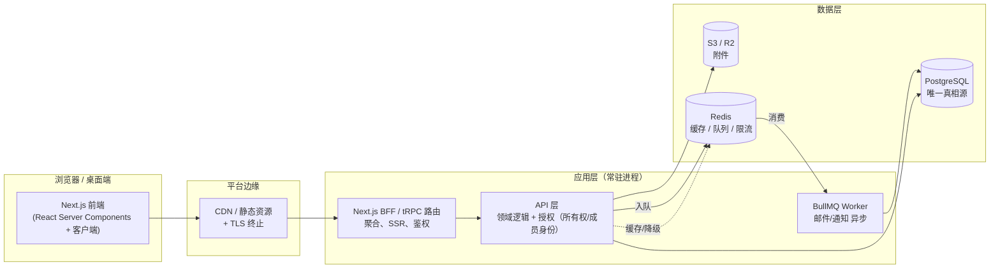
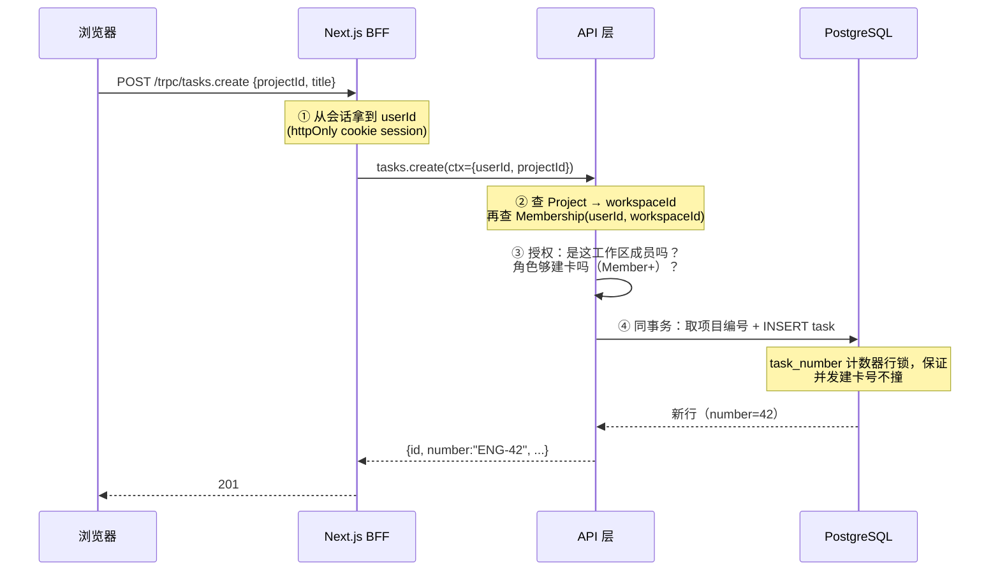
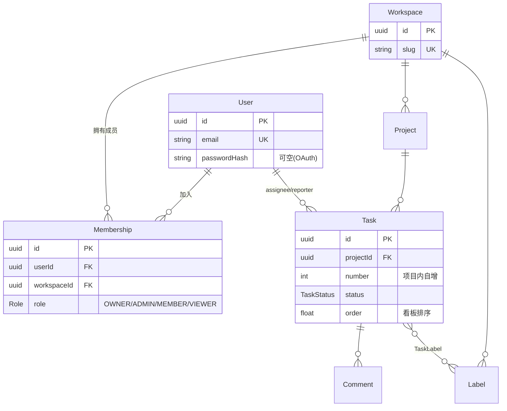
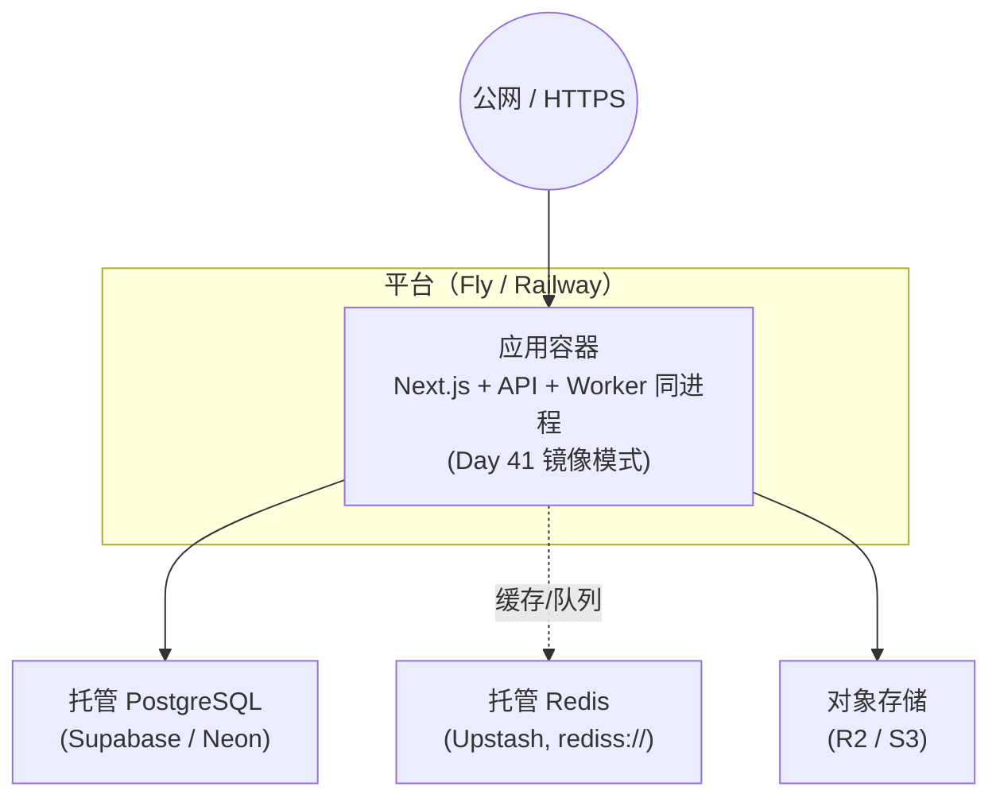

# 架构设计 — SaaS 任务管理平台

> Day 46 的产出。这份文档回答一个问题：**这套系统由哪几块组成、它们怎么协作、为什么这么切**。
> 数据模型见 `prisma/schema.prisma`，API 见 `api-design.md`，单项决策的理由见 `decisions/`。

---

## 1. 一句话定位

一个**带团队协作的任务管理 SaaS**（参考 Trello/Linear 的轻量版）。一个**工作区（Workspace）**是一个团队，几个用户加入同一个工作区，共享里面的**项目（Project）**，项目里有**任务（Task）**，任务下挂**评论（Comment）**和**标签（Label）**。一个真实的人（**User**）可以同时加入多个工作区，在每个工作区里有不同角色（Owner/Admin/Member/Viewer）。

它**不是**企业级多租户——没有「不同客户的数据必须物理隔离」的要求，也没有那一整套 `orgId` 冗余 + RLS 的机器。数据归属走最朴素的路子：**项目属于某个工作区，能看见它 = 你是这个工作区的成员**。这是「普通 SaaS」和「多租户 SaaS」的分界——我们把这条线画在「团队协作」这边，不背上「租户隔离」的复杂度。

---

## 2. 组件视图

几条线的取舍：

- **BFF 和 API 分两层，但部署成一个进程**（Day 47 起会看到）。Next.js 的 server 路由当 BFF：浏览器只跟它说话，它做鉴权、聚合、SSR；领域逻辑放 API 层（tRPC procedure 或 NestJS service）。分层的价值是「前端不直接碰领域规则」，不是「物理拆服务」——早期没必要拆成两个部署单元。
- **Redis 是降级层，不是必填**。缓存 miss 退回直连 PG（Day 36 的老套路），队列不通时邮件降级为下次补发（Day 38）。唯一**必填**的是 PG——连不上启动即崩（Day 44 §7 实测的 fail-fast）。这个不对称是整套可用性的主轴。
- **附件走 S3/R2，不落容器磁盘**。Day 44 §9 已经把这条讲死：容器磁盘是临时的，多实例各写各的。任务附件天然要跨实例共享，对象存储是唯一正解。

---

## 3. 一个请求穿过系统的全过程：创建任务

拿「在项目 ENG 里建一张任务卡」当样本，看每一层各自把什么关把住。关键动作是**鉴权 + 授权**：你是谁、你有没有资格在这个项目里建卡。

每一步都在回答一个具体的「要是漏了会怎样」：

- **② 不信前端传的归属**。请求里只给 `projectId`，「这项目属于哪个工作区」由服务端从库查出来（`projectId → workspaceId`），再查 Membership 验证「这个人是这个工作区的成员」。**不让前端直接传 workspaceId 来授权**——否则攻击者把别人工作区的 id 塞进来就混进去了。前端的 workspaceId 只用来「展示我在哪个团队」，不用来「授权我能动哪个团队」。
- **③ 授权 = 成员身份 + 角色**。两件事串起来：先答「你能不能看见这个项目」（是不是成员），再答「你能不能做这个动作」（角色够不够）。Member 以上能建卡，Viewer 只读。
- **④ 编号自增和插入同事务**。任务编号（ENG-42 的 42）要连续不重复，靠「读项目计数器 + +1 + 写回」在一个事务里完成，否则两个并发建卡会拿到同一个号。Day 29 讲的事务原子性，这里是直接应用。

---

## 4. 数据模型 ER 图

只画核心实体和关系（完整字段见 `prisma/schema.prisma`）。重点看**两条横切的线**：

- **横切线 A（账号 ↔ 团队）：`User — Membership — Workspace`**。Membership 是三合一：连接关系 + 角色 + 软性「加入时间」。权限不在 User 上（一个人在 A 团队是 Admin、在 B 是 Viewer），而在这条关系上。
- **横切线 B（归属链）：`Workspace → Project → Task`**。一个项目属于一个工作区，一个任务属于一个项目。可见性顺着这条链回溯：「你是这个任务所在工作区的成员吗？」——这是应用层鉴权的核心判断，不需要在每行冗余工作区 id。

---

## 5. 部署拓扑（接 Day 44 的成果）

Day 44 把博客推上了 Fly/Railway，那套部署形态这里**直接复用**——这正是「镜像自包含、和运行环境无关」的回报：

和博客部署基本一致，因为这套「普通 SaaS」在基础设施层面没有博客多出来的特殊要求——托管 PG、托管 Redis、对象存储、常驻进程（保 BullMQ worker），全是 Day 44 已经讲透的那几样。一条要提醒的：**托管 PG 的备份（PITR）要开**——用户数据丢了就是真丢了，时间点恢复是最后兜底。

---

## 6. 同步 vs 异步的边界

哪些动作请求里当场做完，哪些扔进队列（Day 38 的 BullMQ）：

| 动作 | 同步还是异步 | 为什么 |
|---|---|---|
| 建任务、改字段、拖看板 | **同步** | 用户在等界面反馈，必须当场落库 + 返回新状态 |
| 任务编号自增 | **同步（同事务）** | 和插入必须原子，不能事后补 |
| 邀请邮件、任务通知、@提及推送 | **异步（队列）** | 第三方（邮件商）慢且会失败，不能让建卡请求卡在发邮件上 |
| 统计聚合（本周完成数） | **异步（定时）** | 重查询，预算好结果缓存，不实时算 |

判断标准只有一句：**用户在不在等这个结果**。在等 → 同步；不在等、或可能失败要重试 → 队列。

---

## 7. 还没画的图（留给后面的天）

诚实地标出这份架构**故意没覆盖**的，避免读出「设计已经完整」的错觉：

- **实时协作**（多人同时改一张卡、光标同步）——ADR-002 明确「同步优先，实时后置」。CRDT/操作变换是后面独立的主题，Day 46 不画。
- **搜索**（任务全文检索）——MVP 用 PG 的 `tsvector` 够；上规模才接 Meilisearch/Elasticsearch，现在不画。
- **计费 / 用量**（按席位/项目数计费）——SaaS 商业化的核心，但和「能跑起来的产品」解耦，留作独立模块。
- **多区域多活**——单区域单实例起步。

这些不是「忘了画」，是 MVP 的边界。边界划在哪，本身是最重要的架构决策——见 `decisions/`。
